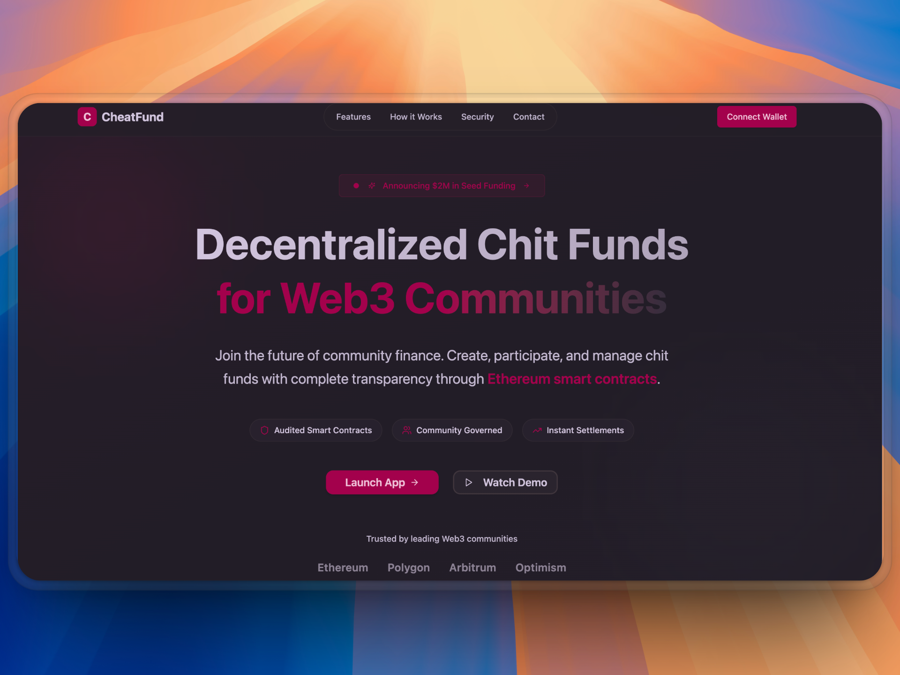
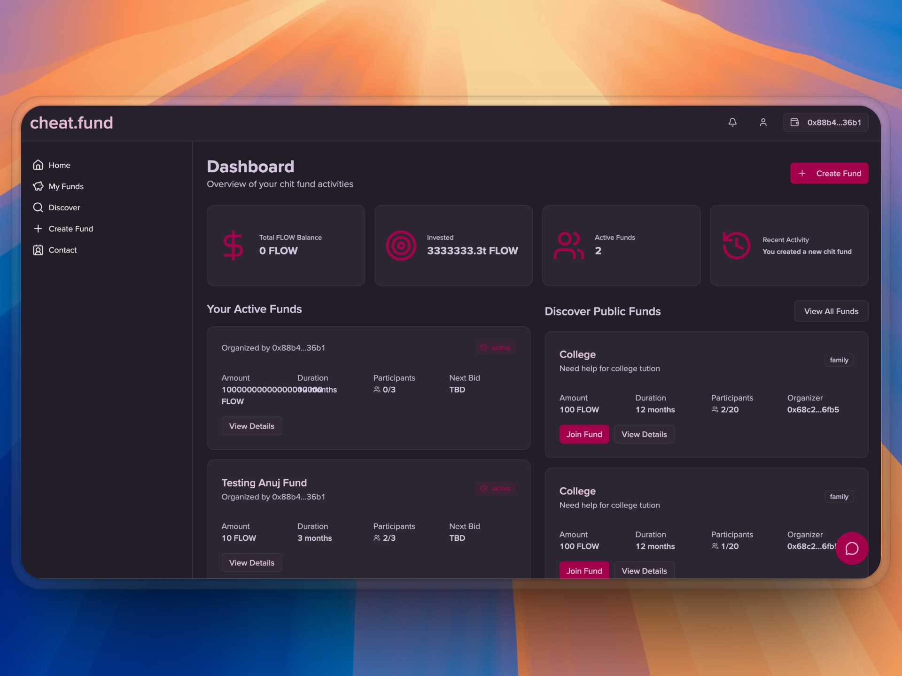
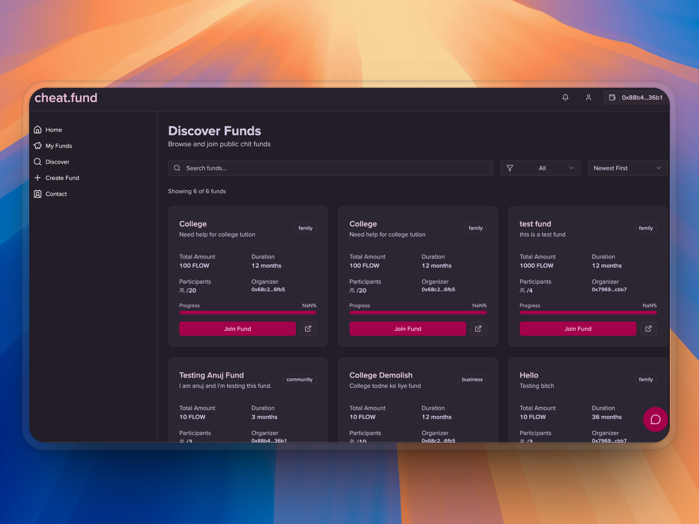

<div align="center">
  
</div>

<h1 align="center">CheatFund: Decentralized Community Finance</h1>

CheatFund is a decentralized platform that migrates the traditional Indian chit fund system to the blockchain. Our mission is to enhance a proven model of community-based finance with unparalleled transparency, security, and automation, making it accessible to a new generation of users while preserving the core tenets of trust and privacy.

The platform addresses the operational inefficiencies and opacity of traditional systems by leveraging smart contracts for fund management and zero-knowledge proofs for identity verification, creating a trustless and efficient financial ecosystem.





**[View the Live Demo](https://landing-page-cheat-fund.vercel.app/)** | **[Explore the Source Code](https://github.com/ayush-that/cheatfund)**

## Core Concepts

CheatFund digitizes the entire lifecycle of a chit fund through a secure, automated protocol.

- **Decentralized Fund Management**: Groups can pool capital and manage funds collectively without relying on a central intermediary. All operations are governed by immutable smart contracts.
- **Algorithmic Winner Selection**: The allocation of the fund pool each cycle is determined by a fair and transparent bidding algorithm, executed on-chain to ensure integrity.
- **On-Chain Auditing and Transparency**: Every transaction, from contribution to distribution, is recorded on a public ledger, providing a complete and verifiable audit trail for all participants.
- **Privacy-Preserving Identity Verification**: We integrate the Anon Aadhaar protocol, allowing users to cryptographically verify their identity and eligibility (e.g., citizenship, age) without revealing any underlying personal data.

## Platform Highlights

| Feature                        | Description                                                                                                                                        |
| ------------------------------ | -------------------------------------------------------------------------------------------------------------------------------------------------- |
| **Zero-Knowledge Identity**    | Leverages ZK-circuits for client-side identity verification, ensuring sensitive user data is never stored or transmitted.                          |
| **Smart Contract Automation**  | Automates the fund lifecycle—contributions, bidding, and payouts—to eliminate manual overhead and minimize counterparty risk.                      |
| **Multi-Network Architecture** | Deployed on Flow EVM for high throughput and low transaction costs, with planned support for Ethereum, Polygon, and other EVM-compatible networks. |
| **Responsive Interface**       | A clean, intuitive dashboard designed for seamless fund management across all devices, ensuring a consistent user experience.                      |
| **Web3 Wallet Integration**    | Natively supports MetaMask and other Web3 wallets for secure authentication and straightforward interaction with the blockchain.                   |

## Technical Architecture

CheatFund is built with a modern, robust technology stack designed for security, scalability, and performance.

- **Smart Contracts**: Solidity, Foundry
- **Blockchain**: Flow EVM, Ethereum, Polygon
- **Frontend**: Next.js 15, TypeScript, Tailwind CSS, shadcn/ui
- **Web3 Integration**: Ethers.js
- **Backend & Database**: Supabase, PostgreSQL, Prisma
- **State Management**: Zustand

## Flow Blockchain Integration

We leverage Flow's EVM equivalence to deploy our Solidity smart contracts while benefiting from Flow's superior performance characteristics. Our implementation includes:

We leverage Flow's EVM equivalence to deploy our Solidity smart contracts while benefiting from Flow's superior performance characteristics. Our implementation includes:

**Smart Contract Deployment**

- ChitFund and ChitFundFactory contracts deployed on Flow Testnet (Chain ID: 545)
- Full EVM compatibility allowing seamless Solidity development
- Native FLOW token support for contributions and distributions

**Network Configuration**

- Primary RPC: `https://testnet.evm.nodes.onflow.org`
- Block Explorer: `https://evm-testnet.flowscan.io`
- Automatic network switching with MetaMask integration
- Flow balance tracking and display components

**Performance Benefits**

- Transaction finality under 3 seconds
- Gas costs under $0.01 per transaction
- Account abstraction for simplified wallet interactions
- On-chain randomness for fair winner selection
- Scalability without sharding complexity

## AI Integration with Fetch.ai & ASI Alliance

We've integrated Fetch.ai's ASI Alliance infrastructure to power intelligent features throughout CheatFund:

**ASI:One Chat Integration**

- Web3-native LLM integration through ASI:One API
- Multiple model support: asi1-mini, asi1-fast, asi1-extended, asi1-agentic
- Real-time chat interface with markdown rendering
- Financial advisor agent for fund management guidance

**Implementation Details**

- Custom ASI provider configuration in `src/lib/ai/asi-provider.ts`
- Chat page at `/chat` with full ASI:One integration
- Fallback to OpenAI for enhanced reliability
- Dynamic model selection based on use case

**AI-Powered Features**

- Intelligent fund recommendations based on user preferences
- Automated risk assessment and fund analysis
- Cross-chain fund monitoring and insights
- Personalized financial advice through conversational AI

## Privacy-Preserving Identity with Anon Aadhaar

We implement a comprehensive privacy-first identity verification system using Anon Aadhaar protocol:

**Zero-Knowledge Identity Verification**

- Client-side proof generation using ZK circuits
- Age verification (18+) without revealing personal data
- Indian citizenship verification through Aadhaar integration
- No sensitive information stored on our servers

**Implementation Architecture**

- Dynamic component loading for SSR compatibility
- Real-time verification status tracking
- Proof validation and storage in local state
- Seamless integration with user authentication flow

**Privacy Guarantees**

- All verification happens client-side in user's browser
- Cryptographic proofs without revealing underlying data
- Local processing with zero data transmission
- Privacy-first design with no personal information storage

## Ethereum Foundation Infrastructure

CheatFund addresses the Ethereum Foundation's infrastructure challenge for Best Client-Side Privacy:

**Unified ZK Registry System**

- Consolidated proof format management for multiple document types
- Anon Aadhaar integration for Indian identity verification
- Age verification using ZK circuits with 18+ proof generation
- Support for passport and other document verification
- Single system managing all proof types with consistent privacy guarantees

**NFC Feature Integration**

- Physical device integration for enhanced UX
- NFC chip support for proof generation
- Tap-to-verify functionality for identity confirmation
- Developer-friendly NFC integration APIs
- Cross-platform support for mobile and desktop environments

**Client-Side Privacy Architecture**

- Zero data storage with all sensitive operations client-side
- ZK proof generation without revealing underlying data
- Local processing for identity verification in user's browser/device
- Privacy-first design with no personal information on servers

## Local Development Setup

To get started with CheatFund on your local machine, follow the steps below.

**Prerequisites:**

- Node.js (v18 or higher)
- pnpm package manager
- A running PostgreSQL instance
- Foundry for smart contract development

**1. Clone the Repository**

```bash
git clone [https://github.com/ayush-that/cheatfund.git](https://github.com/ayush-that/cheatfund.git)
cd cheatfund
```
